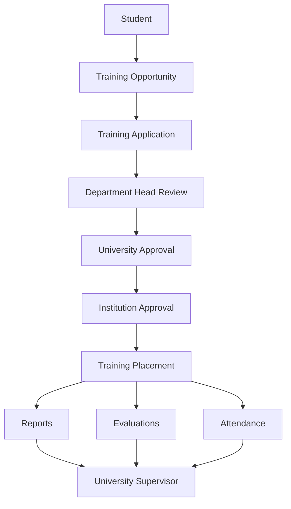
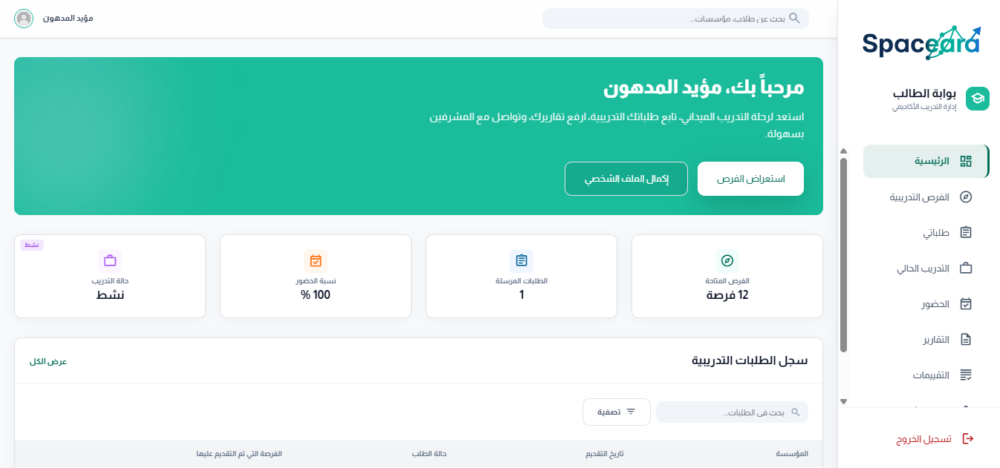
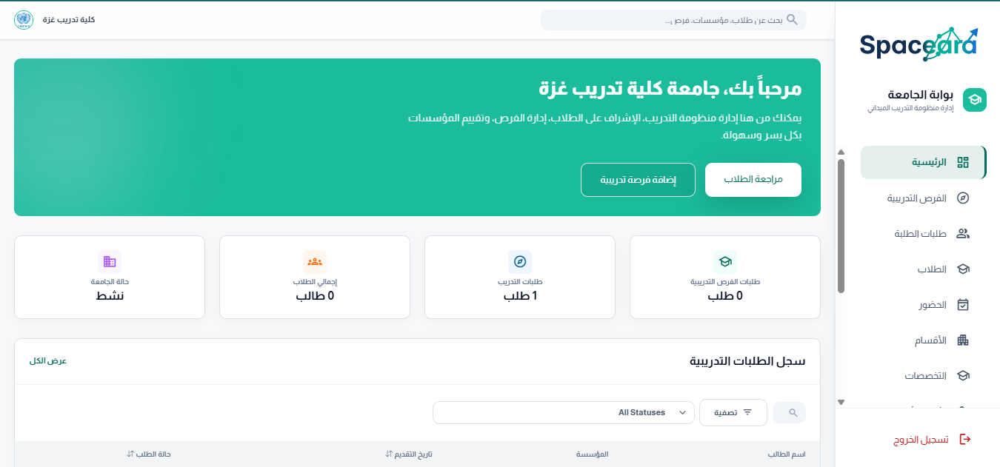
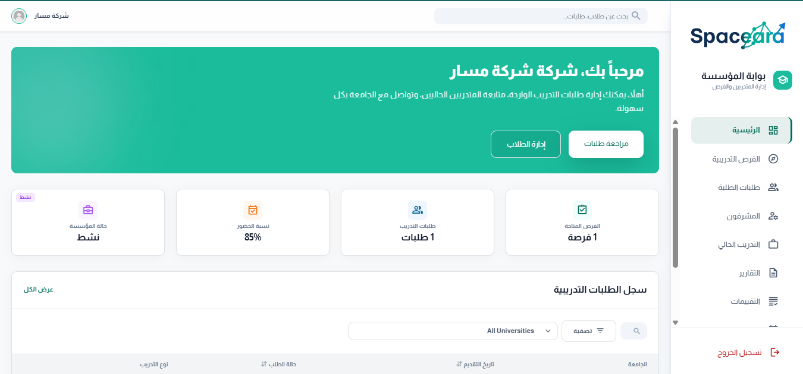

<div align="center">


#  Spaceara

### Smart Field Training Management Platform

#### منصة ذكية لإدارة التدريب الميداني

---

<p align="center">


</p>

###  Connecting Students, Universities and Training Institutions Through One Integrated Platform

### ربط الطلاب والجامعات ومؤسسات التدريب من خلال منصة موحدة متكاملة

</div>

---

#  Project Overview | نبذة عن المشروع

## 🇬🇧 English

Spaceara is a comprehensive Field Training Management Platform designed to digitize and automate the entire training lifecycle between students, universities, and training institutions.

The platform enables students to apply for training opportunities, allows universities to supervise and evaluate trainees, and provides institutions with tools to manage attendance, reports, and evaluations through a centralized role-based system.

## 🇸🇦 العربية

Spaceara هي منصة متكاملة لإدارة التدريب الميداني تهدف إلى رقمنة وأتمتة جميع مراحل التدريب بين الطالب والجامعة ومؤسسة التدريب.

تمكّن المنصة الطلاب من التقديم على فرص التدريب، وتتيح للجامعات الإشراف والتقييم، كما توفر لمؤسسات التدريب أدوات لمتابعة الحضور والتقارير والتقييمات من خلال نظام مركزي متعدد الصلاحيات.

---

#  Project Objectives | أهداف المشروع

### 🇬🇧 English

- Automate field training processes.
- Improve communication among stakeholders.
- Centralize reports, evaluations and attendance.
- Enhance supervision quality.
- Generate statistics and reports for decision making.

### 🇸🇦 العربية

- أتمتة عمليات التدريب الميداني.
- تحسين التواصل بين جميع الأطراف.
- توحيد إدارة الحضور والتقارير والتقييمات.
- رفع جودة الإشراف الأكاديمي والميداني.
- توفير إحصائيات تدعم اتخاذ القرار.

---

#  Problem Statement | المشكلة

### 🇬🇧 English

Many universities still rely on manual and paper-based procedures to manage field training, resulting in inefficient communication, delayed approvals, and fragmented data.

### 🇸🇦 العربية

تعتمد العديد من الجامعات على الإجراءات الورقية والتقليدية لإدارة التدريب الميداني، مما يؤدي إلى ضعف المتابعة وتأخر الموافقات وتشتت البيانات.

---

#  Proposed Solution | الحل المقترح

### 🇬🇧 English

Developing a centralized platform that manages the entire field training process, from opportunity publication and student applications to placements, attendance tracking, evaluations, reports, and supervision.

### 🇸🇦 العربية

تطوير منصة موحدة تدير دورة التدريب الميداني كاملة بدءاً من نشر الفرص والتقديم عليها وحتى التقييم والتقارير والحضور والإشراف الأكاديمي.

---

#  Key Feature | أبرز ميزة

### 🇬🇧 English

The most distinctive feature of Spaceara is its ability to manage the complete training lifecycle through a single platform while enforcing advanced role-based access control to ensure that every stakeholder only accesses relevant information.

### 🇸🇦 العربية

أبرز ما يميز Spaceara هو قدرته على إدارة دورة التدريب الميداني كاملة من خلال منصة واحدة مع نظام صلاحيات متقدم يضمن وصول كل مستخدم فقط إلى البيانات المرتبطة بدوره.

---
# System Roles | أدوار النظام

```text
Student
│
├── Apply for Training Opportunities
├── Submit Reports
├── Track Attendance
└── View Evaluations

University
│
├── University Training Admin
│   ├── Manage Training Process
│   ├── Manage Supervisors
│   ├── Monitor Students
│   └── Review Reports & Evaluations
│
├── Department Head
│   ├── Review Applications
│   ├── Approve / Reject Requests
│   └── Follow Department Students
│
└── University Supervisor
    ├── Monitor Trainees
    ├── Review Reports
    ├── Conduct Field Visits
    └── Submit Evaluations

Training Institution
│
├── Training Officer
│   ├── Manage Training Opportunities
│   ├── Review Applications
│   ├── Accept / Reject Trainees
│   └── Manage Placements
│
└── Institution Supervisor
    ├── Track Attendance
    ├── Monitor Daily Performance
    ├── Evaluate Students
    └── Follow Training Progress
```

---

#  System Workflow



---

#  Screenshots

## Student Portal



---

## University Portal



---

## Institution Portal



---

#  Technologies Used | التقنيات المستخدمة

## Backend

| Technology | Version |
|------------|----------|
| ASP.NET Core Razor Pages | 10.0 |
| C# | .NET 10 |
| Entity Framework Core | 10.x |
| ASP.NET Identity | 10.x |

---

## Frontend

| Technology |
|------------|
| HTML5 |
| CSS3 |
| JavaScript |
| Bootstrap 5 |
| Bootstrap Icons |
| Razor Pages |

---

## Database

| Technology |
|------------|
| SQL Server |

---

#  Main NuGet Packages

```text
Microsoft.EntityFrameworkCore
Microsoft.EntityFrameworkCore.SqlServer
Microsoft.EntityFrameworkCore.Tools

Microsoft.AspNetCore.Identity.EntityFrameworkCore
Microsoft.AspNetCore.Identity.UI

MailKit
MimeKit
```

---

#  External Services

## Email Service

### Purpose

- Email Verification
- OTP Verification
- Notifications
- Password Recovery

### Configuration
## Use this code block in your appsettings.json file & fill it with your data
```json
"SMTP": {
  "Host": "smtp.gmail.com",
  "Port": "587",
  "SenderEmail": "",
  "SenderName": "",
  "Password": ""
},
```

---

## OTP Service

### Purpose

Generate and validate verification codes.

Related Components:

```text
OptService
VerifyCodeEmail
EmailVerificationCode
```

---

#  Database Setup

## Connection String

```json
"ConnectionStrings": {
  "DefaultConnection": ""
}
```

---

#  Installation Guide

## Clone Repository

```bash
git clone https://github.com/MoayadMadhoun/Project/tree/develop
```

## Restore Packages

```bash
dotnet restore
```

## Apply Database Migrations

```bash
dotnet ef database update
```

## Run Application

```bash
dotnet run
```

Or press:

```text
F5
```

inside Visual Studio 2026.

---

#  Core Modules

✅ Students Management

✅ Universities Management

✅ Training Institutions Management

✅ Training Opportunities

✅ Applications Workflow

✅ Placements Management

✅ Attendance Tracking

✅ Reports Management

✅ Evaluations Management

✅ Field Visits Management

✅ Authentication & Authorization

---

#  Security Features

- ASP.NET Identity
- Email Verification
- OTP Verification
- Role-Based Access Control
- Secure Password Management

---
# Development Team

| Team Member | Profile |
|-------------|----------|
| Moayad Al-Madhoun | [Portfolio](https://moayadmadhoun.vercel.app/) |
| Alaa El-zammar | [GitHub](#) |
| Hadeel Zaqout | [GitHub](#) |
| Mohammed Ali | [GitHub](#) |
| Doha Al-Khateeb | [GitHub](#) |
| Maysam Al-Qrinawi | [GitHub](#) |
| Maram Abu Amra | [GitHub](#) |
| Yousef Al-Nijile | [GitHub](#) |

---

<div align="center">


### Spaceara

Smart Field Training Management Platform

Faculty of Engineering & Information Technology

Graduation Project 2025 – 2026

Made by Spaceara Team

</div>
